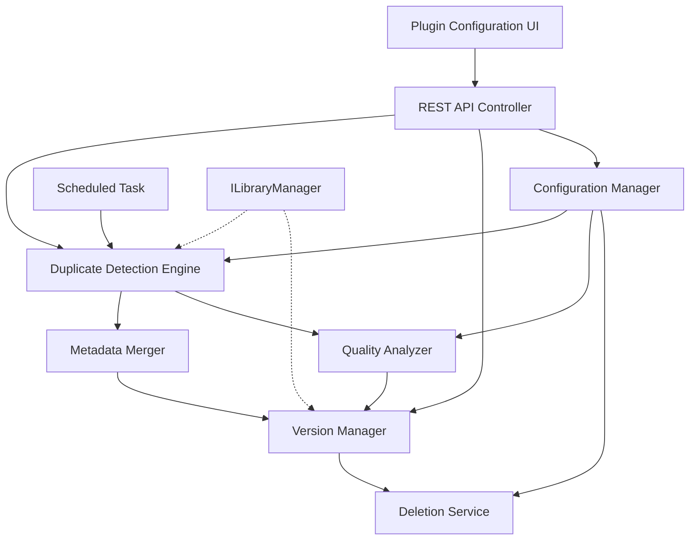
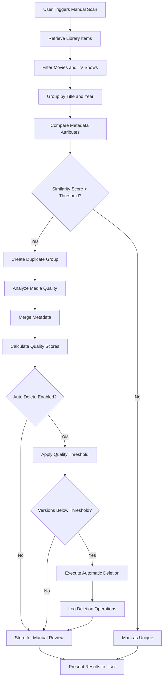
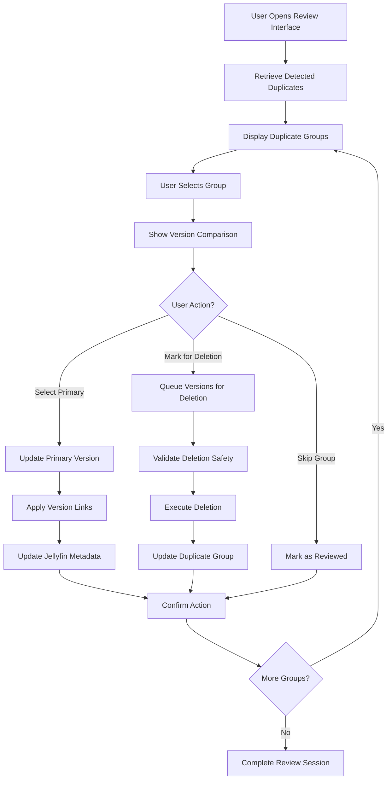
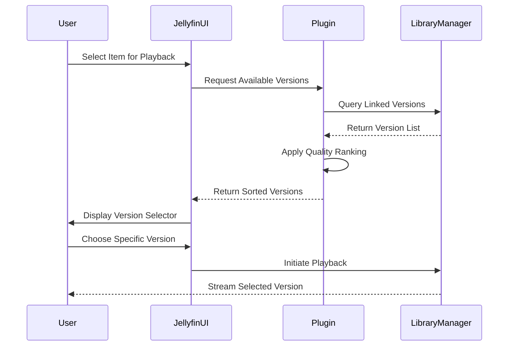

# Smart Duplicate & Versions Management

## Overview

This feature enables intelligent detection, management, and automatic cleanup of duplicate media items within Jellyfin libraries. The system identifies media files representing the same content (movies and TV shows), merges their metadata intelligently, allows users to configure quality preferences, and optionally performs automatic deletion of lower-quality duplicates based on configured criteria.

## Goals and Objectives

### Primary Goals
- Detect duplicate media items across movies and TV shows with high accuracy
- Merge metadata from all versions to provide comprehensive information
- Enable per-library preference configuration for quality priorities
- Support manual scanning with interactive review workflows
- Provide automatic deletion capability for lower-quality duplicates based on user-defined quality thresholds

### Success Criteria
- Duplicate detection accuracy above 95% for items with matching titles and years
- Metadata merge preserves all unique information from all versions
- User preferences consistently applied across library scans
- Safe deletion operations with audit trail and rollback capability
- Performance impact minimal on library operations (detection runs as background task)

## User Requirements

### Functional Requirements

**FR-1: Duplicate Detection**
- The system shall identify duplicate media items within movies and TV shows libraries
- Detection shall compare titles, release years, IMDb IDs, TMDb IDs, and file characteristics
- Detection shall run on-demand via manual scan trigger
- Detection results shall be persisted for review and management

**FR-2: Metadata Merging**
- The system shall automatically merge metadata from all detected duplicate versions
- Merged metadata shall include all unique tags, genres, people, ratings, and descriptions
- The system shall preserve provenance information showing which version contributed which metadata
- Users shall be able to view complete merged metadata for each duplicate group

**FR-3: Quality Preference Configuration**
- The system shall provide per-library quality preference settings
- Preferences shall include resolution priority, codec priority, HDR/SDR preference, audio format priority, and source type priority
- Users shall define quality ranking rules such as "4K HDR > 4K SDR > 1080p HDR > 1080p SDR"
- The system shall evaluate and rank all versions within a duplicate group according to configured preferences

**FR-4: Manual Review Interface**
- Users shall trigger library scans manually through the plugin configuration page
- The system shall present detected duplicates with detailed version comparison
- Users shall select primary version, mark versions for deletion, or skip groups
- The interface shall display quality scores based on user preferences for each version

**FR-5: Automatic Deletion**
- The system shall optionally delete lower-quality duplicates automatically after detection
- Automatic deletion shall only occur when enabled explicitly in per-library settings
- Deletion shall respect configured quality threshold rules
- The system shall maintain audit logs of all deletion operations
- Users shall define minimum quality thresholds for retention (e.g., "keep only 4K or better")

**FR-6: Version Display**
- Duplicate groups shall appear as a single item in the Jellyfin UI
- Users shall select specific versions at playback time through a version selector
- The default playback version shall be determined by quality preference rules
- All versions shall remain accessible unless explicitly deleted

### Non-Functional Requirements

**NFR-1: Performance**
- Duplicate detection shall process libraries with minimal impact on server responsiveness
- Scanning shall run as a background task with configurable resource limits
- Metadata operations shall complete within 2 seconds for groups with up to 10 versions

**NFR-2: Reliability**
- Deletion operations shall be transactional with rollback capability on failure
- The system shall maintain data integrity during concurrent library operations
- Configuration changes shall be persisted reliably without data loss

**NFR-3: Usability**
- Configuration interface shall be intuitive with clear labels and help text
- Scan results shall be presented in a sortable, filterable table format
- Quality scoring shall be transparent with explanations for ranking decisions

## System Architecture

### Component Overview

The plugin architecture consists of five primary components working in coordination:



**Component Responsibilities:**

| Component | Purpose | Key Responsibilities |
|-----------|---------|---------------------|
| Duplicate Detection Engine | Identifies matching media items | Compare metadata attributes, generate similarity scores, group duplicates by identity |
| Metadata Merger | Combines metadata from versions | Aggregate unique metadata fields, track provenance, resolve conflicts |
| Quality Analyzer | Evaluates version quality | Parse media info, apply preference rules, generate quality scores |
| Version Manager | Manages version relationships | Link versions to primary item, control visibility, coordinate playback selection |
| Deletion Service | Handles automatic cleanup | Validate deletion safety, execute removal, maintain audit logs |
| Configuration Manager | Stores user preferences | Persist per-library settings, provide configuration access, validate rules |
| REST API Controller | Exposes operations to UI | Handle scan requests, return duplicate lists, process user actions |
| Scheduled Task | Enables manual scanning | Provide scan trigger, report progress, integrate with Jellyfin task system |

### Data Model

**DuplicateGroup Structure:**

| Field | Type | Description |
|-------|------|-------------|
| GroupId | GUID | Unique identifier for duplicate group |
| LibraryId | GUID | Library containing these duplicates |
| PrimaryVersionId | GUID | Item ID of the primary version |
| Versions | List | Collection of all version records |
| MergedMetadata | Object | Combined metadata from all versions |
| DetectionTimestamp | DateTime | When this group was identified |
| LastReviewedTimestamp | DateTime | When user last reviewed this group |

**VersionRecord Structure:**

| Field | Type | Description |
|-------|------|-------------|
| ItemId | GUID | Jellyfin BaseItem identifier |
| FilePath | String | Full path to media file |
| QualityScore | Integer | Calculated quality rank (higher is better) |
| Resolution | String | Video resolution (e.g., "3840x2160") |
| Codec | String | Video codec (e.g., "HEVC", "H264") |
| DynamicRange | String | HDR or SDR |
| AudioCodec | String | Primary audio codec |
| AudioChannels | String | Audio configuration (e.g., "7.1") |
| SourceType | String | Source classification (e.g., "Remux", "WEB-DL", "BluRay") |
| FileSize | Long | File size in bytes |
| Bitrate | Integer | Overall bitrate in kbps |
| MetadataContribution | List | Metadata fields originating from this version |

**LibraryPreferences Structure:**

| Field | Type | Description |
|-------|------|-------------|
| LibraryId | GUID | Target library identifier |
| ResolutionPriority | List | Ordered list of resolution preferences |
| CodecPriority | List | Ordered list of codec preferences |
| DynamicRangePriority | List | Ordered list (e.g., ["HDR10+", "HDR10", "SDR"]) |
| AudioPriority | List | Ordered list of audio format preferences |
| SourceTypePriority | List | Ordered list of source type preferences |
| AutoDeleteEnabled | Boolean | Whether to automatically delete lower-quality duplicates |
| MinimumQualityThreshold | String | Minimum quality to retain (e.g., "4K") |
| RequireManualReview | Boolean | Whether to require user confirmation before deletion |

### Workflow Diagrams

**Duplicate Detection Workflow:**



**Manual Review Workflow:**



**Version Selection at Playback:**



## Core Features

### Feature 1: Duplicate Detection Engine

**Purpose:**
Identify media items representing the same content across library files with high accuracy while minimizing false positives.

**Detection Strategy:**

The engine employs a multi-stage matching process:

**Stage 1: Initial Grouping**
- Group items by normalized title (case-insensitive, remove special characters)
- Filter groups to include only those with 2 or more items
- Apply year tolerance of ±1 year to account for metadata variations

**Stage 2: Similarity Scoring**
- Calculate weighted similarity score across multiple attributes:
  - Title exact match: 30 points
  - Year match: 20 points
  - IMDb ID match: 40 points
  - TMDb ID match: 40 points
  - Runtime similarity (within 5 minutes): 10 points
- Minimum threshold: 50 points for duplicate classification

**Stage 3: Duplicate Group Formation**
- Create DuplicateGroup records for items exceeding threshold
- Assign unique GroupId
- Link all matching versions to group

**Integration Points:**
- Uses ILibraryManager to access media items
- Queries BaseItem metadata for comparison attributes
- Operates on Libraries filtered by media type (movies, TV shows)

**Configuration:**
- Similarity threshold adjustable per library
- Option to enable/disable specific matching criteria
- Support for manual override to force or break grouping

### Feature 2: Metadata Merger

**Purpose:**
Combine metadata from all versions of duplicate media to provide the most complete and accurate information.

**Merge Strategy:**

**Field-Level Merge Rules:**

| Metadata Field | Merge Strategy | Example |
|----------------|----------------|---------|
| Title | Use most complete version | Prefer version with subtitle if available |
| Description | Concatenate unique descriptions | Combine plot summaries from different sources |
| Genres | Union of all unique genres | ["Action", "Thriller"] + ["Action", "Drama"] = ["Action", "Thriller", "Drama"] |
| Tags | Union of all unique tags | Merge collection tags, edition tags |
| People (Actors, Directors) | Union with role preservation | Merge cast lists, preserve character names |
| Ratings | Average of all ratings | Average IMDb, Rotten Tomatoes, etc. |
| Release Dates | Use earliest date | Preserve original theatrical release |
| Studios | Union of all studios | Merge production companies |
| External IDs | Union of all IDs | Preserve all IMDb, TMDb, TVDb links |

**Provenance Tracking:**
- Each metadata field records source version
- UI displays which version contributed each piece of information
- Users can see metadata origin for transparency

**Conflict Resolution:**
- For contradictory information, prefer version with higher quality score
- Allow manual override in review interface
- Log conflicts for user review

**Jellyfin Integration:**
- Merged metadata written to primary version's BaseItem
- Secondary versions maintain original metadata but link to primary
- Changes propagate to Jellyfin's metadata storage

### Feature 3: Quality Analyzer

**Purpose:**
Evaluate and rank versions based on user-defined quality preferences to determine optimal version for playback and retention.

**Quality Scoring Algorithm:**

The analyzer calculates a composite quality score using weighted criteria:

**Base Score Calculation:**

| Criterion | Weight | Scoring Method |
|-----------|--------|----------------|
| Resolution | 30% | Rank position in ResolutionPriority list |
| Dynamic Range | 25% | Rank position in DynamicRangePriority list |
| Video Codec | 20% | Rank position in CodecPriority list |
| Audio Format | 15% | Rank position in AudioPriority list |
| Source Type | 10% | Rank position in SourceTypePriority list |

**Score Formula:**
```
Final Score = (Resolution Score × 0.30) +
              (Dynamic Range Score × 0.25) +
              (Video Codec Score × 0.20) +
              (Audio Format Score × 0.15) +
              (Source Type Score × 0.10)

Where each component score = (Priority List Length - Item Position) / Priority List Length × 100
```

**Media Information Extraction:**
- Parse media container to extract technical specifications
- Read resolution, codec, bitrate, audio channels from file metadata
- Infer source type from file name patterns and quality indicators
- Detect HDR metadata from video stream properties

**Default Quality Preferences:**

**Resolution Priority (highest to lowest):**
1. 4320p (8K)
2. 2160p (4K)
3. 1440p (2K)
4. 1080p (Full HD)
5. 720p (HD)
6. 576p (SD)
7. 480p (SD)

**Dynamic Range Priority:**
1. HDR10+
2. Dolby Vision
3. HDR10
4. HLG
5. SDR

**Video Codec Priority:**
1. AV1
2. HEVC (H.265)
3. H.264
4. VP9
5. MPEG-4

**Audio Format Priority:**
1. Dolby Atmos
2. DTS:X
3. TrueHD 7.1
4. DTS-HD MA 7.1
5. DTS-HD MA 5.1
6. AC3 5.1
7. AAC Stereo

**Source Type Priority:**
1. Remux
2. BluRay
3. WEB-DL
4. WEBRip
5. HDTV
6. DVDRip

### Feature 4: Manual Review Interface

**Purpose:**
Provide users with comprehensive tools to review detected duplicates, compare versions, and make informed decisions about retention and deletion.

**Interface Components:**

**Duplicate Groups List:**
- Tabular display of all detected duplicate groups
- Columns: Title, Library, Version Count, Primary Version, Detection Date, Status
- Filtering: By library, by review status, by version count
- Sorting: By any column, default to detection date descending
- Pagination: 50 groups per page

**Version Comparison View:**
- Side-by-side comparison of all versions in selected group
- Technical details table showing resolution, codec, bitrate, file size
- Quality score visualization with bar chart
- Metadata comparison highlighting differences
- File path and storage location display

**Action Buttons:**
- "Set as Primary": Designate selected version as primary for playback
- "Delete Version": Mark version for deletion with confirmation prompt
- "Keep All": Mark group as reviewed without changes
- "Skip": Move to next group without action
- "Undo": Reverse last action in current session

**Confirmation Dialogs:**
- Deletion confirmation showing version details
- Batch action confirmation for multiple selections
- Warning for automatic deletion if enabled

**Progress Tracking:**
- Review session progress indicator
- Count of reviewed vs. pending groups
- Summary of actions taken in session

### Feature 5: Automatic Deletion Service

**Purpose:**
Safely remove lower-quality duplicate versions based on user-configured quality thresholds while maintaining data integrity and audit trails.

**Deletion Logic:**

**Pre-Deletion Validation:**
- Verify at least one version meets minimum quality threshold before deleting any version
- Ensure primary version is never deleted
- Confirm file exists and is accessible before attempting deletion
- Check for active playback sessions on target versions

**Quality Threshold Evaluation:**
- Parse MinimumQualityThreshold setting (e.g., "4K", "1080p HDR", "Remux")
- Convert threshold to comparable quality score
- Identify versions with scores below threshold
- Apply additional safety checks (never delete if only 1 version exists)

**Deletion Execution:**
- Remove file from filesystem
- Update Jellyfin library to remove item reference
- Update DuplicateGroup record to reflect deletion
- Maintain version links for remaining versions
- Trigger library refresh for affected items

**Audit Trail:**
- Log every deletion operation with timestamp
- Record: GroupId, ItemId, FilePath, QualityScore, DeletionReason, UserInitiated
- Store audit logs in plugin data directory
- Provide audit log viewer in configuration interface

**Rollback Capability:**
- Maintain deletion records for 30 days
- Display recently deleted items in audit interface
- Provide information to assist manual file recovery
- Note: Actual file recovery requires external backup system

**Safety Features:**
- Configurable "dry run" mode to preview deletions without executing
- Option to move files to quarantine directory instead of permanent deletion
- Automatic disable if deletion error rate exceeds threshold
- Email notification option for deletion operations

### Feature 6: Version Manager

**Purpose:**
Coordinate version relationships, control UI visibility, and manage playback version selection to provide seamless multi-version support.

**Version Linking:**
- Establish parent-child relationships between primary and secondary versions
- Store version links in plugin database
- Synchronize links with Jellyfin's internal data structures
- Update links when primary version changes

**Visibility Control:**
- Hide secondary versions from default library views
- Show only primary version in browsing interfaces
- Maintain searchability of all versions for administrative access
- Provide "Show All Versions" toggle in item details

**Playback Coordination:**

**Version Selector Implementation:**
- Intercept playback requests for items with multiple versions
- Present version selection dialog before playback initiation
- Display version details: quality score, resolution, file size
- Remember user's last selection preference per item

**Default Version Selection:**
- Use highest quality score version as default
- Allow user to override default per duplicate group
- Respect "always prefer" settings from library preferences
- Fall back to primary version if quality scores are equal

**Integration Points:**
- Extend Jellyfin's playback API to support version parameter
- Hook into media streaming pipeline to route to selected version
- Update playback history to record which version was played
- Provide version statistics in plugin dashboard

## Configuration

### Plugin Configuration Structure

**Global Settings:**

| Setting | Type | Default | Description |
|---------|------|---------|-------------|
| EnablePlugin | Boolean | true | Master enable/disable for all plugin functionality |
| ScanThreads | Integer | 2 | Number of parallel threads for duplicate detection |
| LogLevel | Enum | Info | Logging verbosity (Debug, Info, Warning, Error) |
| AuditRetentionDays | Integer | 30 | Days to retain deletion audit logs |
| DryRunMode | Boolean | false | Preview deletions without executing when true |

**Per-Library Settings:**

Each library can have independent configuration stored in LibraryPreferences structure.

**User Interface:**
- Configuration page accessible from Jellyfin Dashboard → Plugins → Smart Duplicate Management
- Tabbed interface: General, Libraries, Audit Logs, Advanced
- Library selection dropdown to configure individual libraries
- Import/Export buttons for preference profiles
- Reset to defaults button with confirmation

**Configuration Persistence:**
- Settings stored in plugin configuration file
- Automatic save on change with validation
- Configuration version tracking for migration
- Backup creation before major changes

## API Endpoints

### REST API Design

The plugin exposes REST API endpoints through an ASP.NET Core Controller.

**Base Path:** `/api/smart-duplicate-management/`

**Endpoint Definitions:**

| Method | Path | Purpose | Request Body | Response |
|--------|------|---------|--------------|----------|
| POST | `/scan/library/{libraryId}` | Trigger duplicate scan for specific library | None | Scan job ID and status |
| GET | `/scan/status/{jobId}` | Get scan job progress | None | Progress percentage and status message |
| GET | `/duplicates/library/{libraryId}` | Retrieve detected duplicates | None | List of DuplicateGroup objects |
| GET | `/duplicates/group/{groupId}` | Get detailed duplicate group info | None | DuplicateGroup with all versions |
| POST | `/duplicates/group/{groupId}/set-primary` | Set primary version | `{ versionId: GUID }` | Updated DuplicateGroup |
| POST | `/duplicates/group/{groupId}/delete-version` | Delete specific version | `{ versionId: GUID }` | Deletion confirmation |
| POST | `/duplicates/group/{groupId}/keep-all` | Mark group as reviewed | None | Updated status |
| GET | `/preferences/library/{libraryId}` | Get library preferences | None | LibraryPreferences object |
| PUT | `/preferences/library/{libraryId}` | Update library preferences | LibraryPreferences object | Success confirmation |
| GET | `/audit/deletions` | Get deletion audit log | Query params: startDate, endDate, libraryId | List of audit records |

**Authentication:**
- All endpoints require Jellyfin authentication
- User must have library management permissions
- API key support for automation scenarios

**Error Handling:**
- Standard HTTP status codes (200, 400, 401, 404, 500)
- Structured error responses with message and error code
- Validation errors include field-level details

## Data Persistence

### Storage Architecture

**Plugin Data Directory:**
- Location: `{jellyfin-data-dir}/plugins/SmartDuplicateManagement/`
- Structure:
  - `/data/` - Duplicate group records
  - `/audit/` - Deletion logs
  - `/config/` - Library preferences

**Storage Formats:**

**DuplicateGroup Storage:**
- Format: JSON files per library
- File naming: `duplicates_{libraryId}.json`
- Indexed by GroupId for fast lookup
- Periodic consolidation to prevent fragmentation

**Audit Log Storage:**
- Format: Append-only JSON lines
- File naming: `audit_{year}_{month}.jsonl`
- Rotation: Monthly with automatic archival
- Compression: Gzip for archived months

**Configuration Storage:**
- Leverages Jellyfin's plugin configuration system
- XML format managed by IXmlSerializer
- Automatic backup before modifications
- Migration support for version upgrades

**Database Considerations:**
- Current design uses file-based storage for simplicity
- Future enhancement: Optional SQLite database for large libraries
- Migration path: Import existing JSON data into database
- Performance threshold: Consider database when managing >10,000 duplicate groups

### Data Synchronization

**Jellyfin Library Synchronization:**
- Listen to library change events via ILibraryManager
- Invalidate duplicate groups when source items are modified
- Re-scan affected groups when metadata changes
- Handle item deletion by updating duplicate group records

**Concurrent Access:**
- File-level locking for write operations
- Read operations use snapshot consistency
- Queue serialization for deletion operations
- Conflict resolution: Last write wins with version tracking

## Testing Considerations

### Test Coverage Areas

**Unit Testing:**
- Duplicate detection similarity scoring algorithm
- Metadata merge logic for all field types
- Quality score calculation with various inputs
- Preference rule evaluation and ranking

**Integration Testing:**
- Jellyfin library manager interactions
- Configuration persistence and retrieval
- REST API endpoint behavior
- Version linking and visibility control

**End-to-End Testing:**
- Complete scan workflow from trigger to results
- Manual review workflow with all actions
- Automatic deletion with various thresholds
- Version selection during playback

**Performance Testing:**
- Scan performance with libraries of varying sizes (100, 1000, 10000 items)
- Concurrent scan operations
- API response times under load
- Memory consumption during large scans

**Safety Testing:**
- Deletion validation prevents accidental data loss
- Rollback mechanisms function correctly
- Audit trail completeness and accuracy
- Error handling prevents corruption

### Test Data Requirements

**Test Libraries:**
- Small library: 100 items with 10 duplicate groups
- Medium library: 1000 items with 50 duplicate groups
- Large library: 10000 items with 200 duplicate groups

**Test Scenarios:**
- Perfect matches (identical metadata)
- Partial matches (similar but not identical)
- False positive candidates (similar titles, different content)
- Missing metadata (incomplete information)
- Multi-version groups (3+ versions of same item)

## Security Considerations

### Access Control

**Permission Requirements:**
- Library management permission required for all operations
- Admin permission required for configuration changes
- Audit log access restricted to admin users
- API endpoints enforce Jellyfin's authentication

**Data Protection:**
- Sensitive file paths logged only with appropriate permissions
- Deletion operations require explicit user confirmation
- Configuration changes validated before persistence
- API inputs sanitized to prevent injection attacks

### File System Safety

**Deletion Safety:**
- Never delete files outside configured library paths
- Validate file ownership before deletion
- Prevent deletion of actively playing media
- Maintain audit trail for forensic analysis

**Path Validation:**
- Sanitize all file path inputs
- Prevent path traversal attacks
- Verify paths resolve within library boundaries
- Use absolute paths for all operations

## Performance Optimization

### Scanning Optimization

**Parallel Processing:**
- Divide library items into batches for parallel processing
- Configurable thread count based on server resources
- Use thread pool for efficient resource utilization
- Implement cancellation token support for graceful shutdown

**Caching Strategy:**
- Cache BaseItem metadata during scan to reduce database queries
- Maintain in-memory index of processed items
- Cache quality analysis results to avoid re-parsing media files
- Invalidate cache on library refresh events

**Incremental Scanning:**
- Track last scan timestamp per library
- Process only items added or modified since last scan
- Maintain scan checkpoint for resumability
- Provide full scan option to override incremental mode

### Resource Management

**Memory Management:**
- Stream large result sets instead of loading entirely in memory
- Dispose ILibraryManager query results promptly
- Limit concurrent scan operations based on available memory
- Implement backpressure for batch processing

**Disk I/O Optimization:**
- Batch write operations for duplicate group updates
- Use buffered streams for audit log writes
- Compress archived data to reduce storage footprint
- Implement read-ahead caching for frequently accessed data

## Migration and Upgrade Path

### Version Migration

**Configuration Migration:**
- Detect configuration version on plugin load
- Apply migration transformations sequentially
- Preserve backward compatibility for one major version
- Log migration steps for troubleshooting

**Data Migration:**
- Convert existing duplicate group records to new schema
- Migrate audit logs to updated format
- Transform preference structures for new features
- Validate migrated data integrity

**Rollback Support:**
- Backup configuration before migration
- Maintain previous version data files during migration
- Provide manual rollback procedure in documentation
- Test migration path in isolated environment

## Monitoring and Observability

### Logging Strategy

**Log Levels:**
- Debug: Detailed algorithm steps, similarity scores, decision points
- Info: Scan start/complete, configuration changes, user actions
- Warning: Potential issues, validation failures, performance concerns
- Error: Operation failures, exceptions, data corruption

**Structured Logging:**
- Include contextual information: LibraryId, GroupId, UserId
- Log performance metrics: scan duration, items processed
- Record decision rationale: why items matched, quality scoring details
- Maintain correlation IDs for tracing operations

### Metrics and Dashboard

**Key Metrics:**
- Total duplicate groups detected per library
- Storage space recoverable through deletion
- Average quality score distribution
- Scan performance trends over time
- Deletion operation success rate

**Dashboard Widgets:**
- Summary card: Total duplicates, total versions, space savings
- Recent activity: Latest scans, deletions, reviews
- Library statistics: Per-library duplicate counts and storage impact
- Quality distribution: Chart showing version quality spread

## Future Enhancements

### Potential Extensions

**Advanced Matching:**
- Perceptual hash comparison for video content
- Audio fingerprinting for music duplicates
- Subtitle language matching for version differentiation
- Machine learning-based similarity scoring

**Enhanced Automation:**
- Scheduled automatic scanning on library refresh
- Intelligent quality preference learning from user choices
- Predictive duplicate detection during library import
- Batch operations API for third-party integration

**User Experience:**
- Mobile-responsive review interface
- Bulk action workflows for large duplicate sets
- Version comparison preview clips
- Export duplicate reports to CSV/Excel

**Integration:**
- Notification system integration for deletion alerts
- Webhook support for external automation
- Integration with external media management tools
- Cloud storage provider support for deletion operations

## Risks and Mitigation

| Risk | Impact | Likelihood | Mitigation Strategy |
|------|--------|------------|---------------------|
| False positive duplicate detection | High | Medium | Implement conservative similarity thresholds, require manual review by default, provide user override |
| Accidental deletion of wanted media | Critical | Low | Multi-stage confirmation, audit trail, dry-run mode, quarantine option instead of immediate deletion |
| Performance degradation on large libraries | Medium | High | Implement incremental scanning, resource throttling, background task prioritization, caching |
| Metadata corruption during merge | High | Low | Validate merged data structure, maintain original metadata backups, provide manual rollback |
| Incompatibility with Jellyfin updates | Medium | Medium | Target stable Jellyfin APIs, test against beta releases, maintain compatibility layer |
| Storage exhaustion from audit logs | Low | Medium | Implement log rotation, compression, configurable retention periods, automatic cleanup |

## Dependencies

### External Dependencies

**Jellyfin Core APIs:**
- ILibraryManager: Media item access and library operations
- IUserManager: User authentication and permissions
- IXmlSerializer: Configuration serialization
- IApplicationPaths: Plugin data directory location
- ITaskManager: Integration with scheduled task system

**Media Analysis Libraries:**
- MediaInfo or FFprobe integration for technical metadata extraction
- Required for quality analysis and codec detection
- Invoke as external process or native library binding

**Framework Dependencies:**
- .NET 9.0 runtime
- ASP.NET Core for REST API controller
- System.Text.Json for JSON serialization
- System.Threading.Tasks for async operations

### Version Compatibility

**Jellyfin Version Requirements:**
- Minimum supported version: 10.11.3
- Recommended version: 10.11.3 or later
- API compatibility maintained through interface contracts
- Breaking changes handled through version detection

## Deployment Considerations

### Installation

**Plugin Distribution:**
- Distributed through official Jellyfin plugin repository
- Manual installation: Copy DLL to plugins directory
- Configuration file created automatically on first run
- Default settings enable safe operation without user configuration

**Initial Setup:**
- Plugin appears in Jellyfin Dashboard after installation
- User navigates to plugin configuration page
- Configure at least one library before first scan
- Recommend starting with small test library

### Configuration Recommendations

**Conservative Defaults:**
- Automatic deletion disabled by default
- Require manual review for all duplicate groups
- Moderate similarity threshold to minimize false positives
- Performance limits set for average server hardware

**Best Practices:**
- Test with small library first to validate detection accuracy
- Review detected duplicates before enabling automatic deletion
- Configure quality preferences to match personal collection goals
- Enable audit logging for accountability
- Schedule scans during low-usage periods

### Rollback Procedure

**Plugin Removal:**
- Stop Jellyfin server
- Remove plugin DLL from plugins directory
- Optionally preserve plugin data directory for future reinstall
- Restart Jellyfin server

**Data Cleanup:**
- Version links persist in Jellyfin database
- Manual cleanup required to restore secondary version visibility
- Provide cleanup utility script for complete removal
- Document manual steps for visibility restoration

## Success Metrics

### Measurement Criteria

**Functional Metrics:**
- Duplicate detection accuracy: >95% true positive rate
- False positive rate: <5%
- Metadata merge completeness: 100% field coverage
- Deletion success rate: >99%

**Performance Metrics:**
- Scan throughput: >100 items per second on reference hardware
- API response time: <500ms for duplicate list retrieval
- Memory usage: <500MB during scan of 10,000 item library
- Disk I/O: Minimal impact on concurrent media playback

**Usability Metrics:**
- Configuration completion time: <5 minutes for experienced users
- Review workflow efficiency: <30 seconds per duplicate group
- User error rate: <1% accidental deletions
- Documentation clarity: User satisfaction survey >4/5 rating

**Business Metrics:**
- Storage space recovered: Measurable per library
- User adoption rate: Track active users per month
- Support ticket volume: Low issue rate indicates good design
- Community feedback: Positive sentiment in forums and reviews- Support ticket volume: Low issue rate indicates good design
- Community feedback: Positive sentiment in forums and reviews
